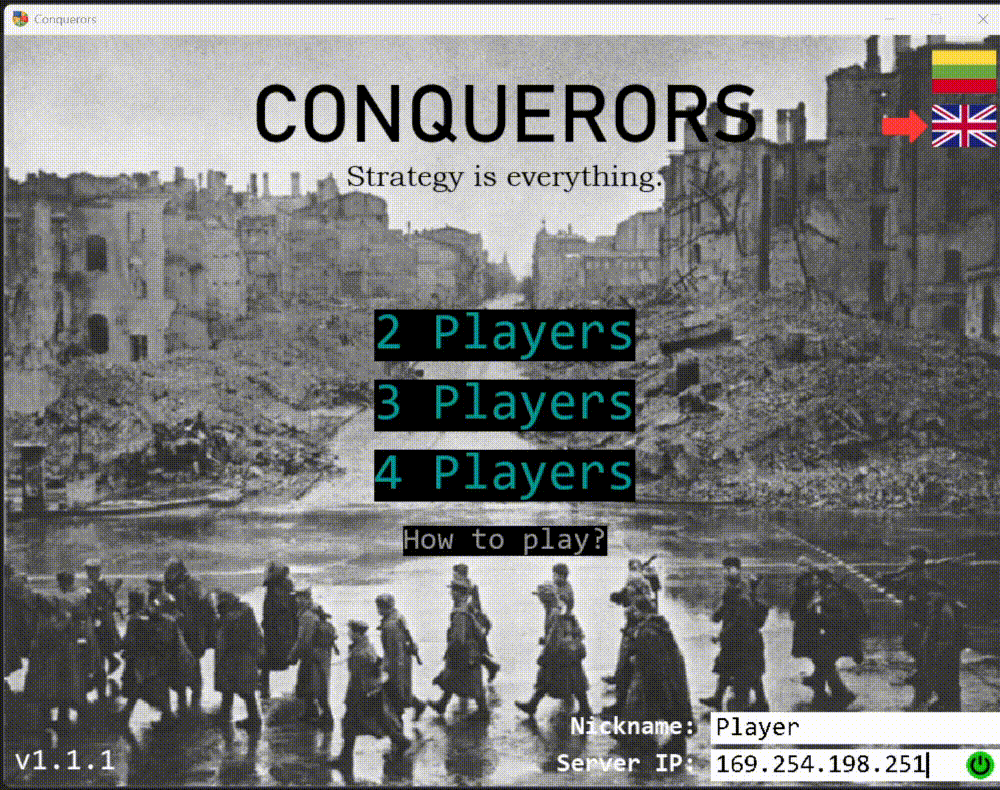

# Conquerors v1.1.1 is here!
### A competitive multiplayer territory occupation game for having lots and lots of fun playing either alone or with relatives and friends connected in a local network!
_Take over your opponents' land and become the largest empire in Europe. Last standing wins..._

> [!NOTE]
> The game is made for self-educational and entertainment purposes only, thus it has no political meaning whatsoever.

> [!IMPORTANT]
> * Game guide is present immediately after launching the game for the first time or by pressing a button in the menu!
> 
> * You must launch a server on your own to start playing, as well as the game client.
>
> * Server supports **multiple gameplays** at once!
>
> * Bots are implemented to play with you if no one else can.

## Installation & Quick Start

> [!CAUTION]
> This is the source code and no executable files are provided. Thus, you must ensure you have Python 3.12.0+ installed and added as an environment variable on your machine.

1. **Clone** this code onto your Windows computer;
2. **Run** `run-server.bat` (found in the top directory) to start a server and `run-player.bat` to launch the game client. Alternatively - run `run.bat` to start both;
3. You're **good to go**!

  Developed by <b>Rimantas R.</b>  

